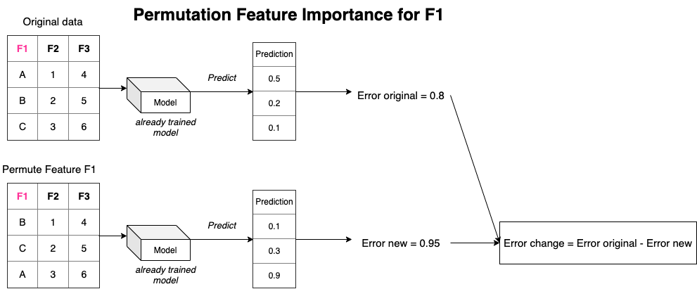
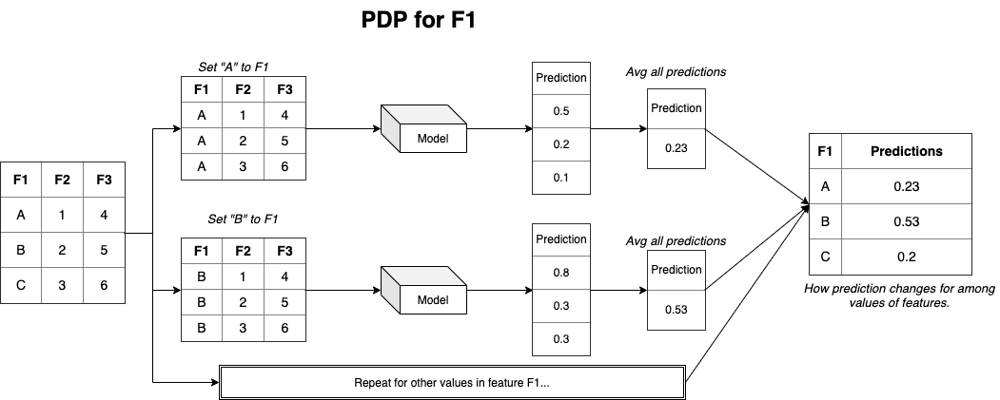
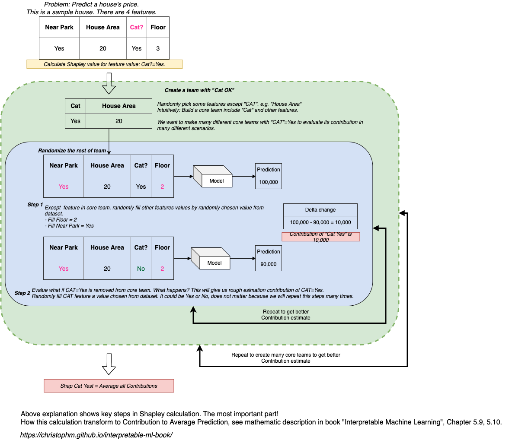

This repo summarizes what I learned from 

> Molnar, Christoph. "Interpretable machine learning. A Guide for Making Black Box Models Explainable", 2019. https://christophm.github.io/interpretable-ml-book/.

It includes: 

- Parts from the book that I found useful in realworld.
- Refer techiniques that is Model Agnostic (do not depend on specific model). In modeling practice, we can compare several models together easily.
- Include Notebook demo.
- No math, just layman explanation.
- Focus on tabular data.

To better understand the topic, I suggest you should give the book a try.

# What is Interpretability of a Machine Learning

Interpretability measures *how easy* for human to understand why model makes a certain prediction. *How easy* is not a quantity. That why it is hard to make a metric to measure the Intepretablity of a model. In practice, we seperate model into 2 types: Glassbox and Blackbox. Glassbox is easier to understand than Blackbox. Take a look at some Glassbox and Blackbox model below:

- Glassbox model: Linear Regression, Logistic Regression, Decision Tree, etc.
- Blackbox model: Random Forest, Gradient Boosting, Neural Network, Stacking model, etc.

We can see that it is so easy to understand the prediction of Linear Regression, for example: $$ prediction = bias + weight_1 * feature_1 + weight_2 * feature_2 + ... $$. Value of weights or values of features can give us a lot of hints to understand final prediction. In contrast, to understand prediction of a Random Forest model, we need to track all predictions of all Tree models in Random Forest then combine all predictions into finally single prediction. If a specific feature is used in 2 different trees of a Random Forest model, understand how that feature affect final prediction is really hard.

In general, Predictive power and Intepretability are Negatively correlated.

# Why Interpretability

- In general, human being is curious and needs to learn about the world. When a model made a wrong prediction, we want to know: Why did it make this decision? Or when a model makes a correct prediction, we then keep asking: Why did it make this prediction? In both case, we all want to know which factors model used to calculate prediction. Hopefully, we can find out some unexpected behavior of model. If the person who are asking these question is our customers, they have the right to ask, we better to prepare some answers.

- Knowing which factors affect prediction helps us detect bias in model. If a model always gives men higher favor, we want a debugging tool to address this. Eventually we can remove the discrimination in prediction.

- Build Trust. It is difficult to use model in a critical environment (Finance, Insurance, etc.) if we do not understand how model make prediction.

Not every model needs intepretability. In some low impact environment (recommend a song to listener), why do I get this recommendation is not important. As long as it is a good song. In this case, we should looking for a strong predictive model instead.

# What makes a good Intepretability

- Picking 2 samples with different prediction (one with probability 0.95 and one with probability 0.15), we should be able to show different explanations for this: Compare to high score, what makes low score prediction? Explanation should show the contrast between 2 predictions.
- Explanation must be short, 1 to 3 reason. Audience just needs several features that mostly affect predictions. Even if the world is complext, picking top important factors can help us simplify the explnation and make audience understand it seasier.
- If feature is abnormal and it affects predictions, then explanation must show that feature.
- Consistent with our prior belief. If we believe larger house and higher price are correlated, then explanation should reveal that.

# (Partial) Global Intepretability

In this category of interpretability, we are interested in how part of model affect prediction. For example: In linear regression model, how does each weight contributes to final output?. In Random Forest model, how does feature $ X1 $ affect final probability?

Techniques used in this category mainly explore the relationship between feature and prediction. Some popular techiniques:

- Permutation Feature Importance: Measure the changes in error if we permuted feature's value.
- Partial Dependence Plot: Show marginal effect of feature on prediction.

# Local Intepretability

In this category, we try to explain why model makes prediction on a single example. For example: RandomForest gives sample X1 a probability of 73%. How did model come up with this number.

Common techniques focus on explain single feature and quantify its affect to prediction. For example: Feature F1 add 0.15 to average prediction.

# Permutation Feature Importance

There are several way to measure how importance a feature is to a model (called Feature Importance).

- In Linear Model, it is in the list of weights. Large weight is more important.
- In Tree model, if a feature is used to split many times (or splitting that feature gives really good predictive power), that feature is important to model.

But each of above methods are specific to model. Compare weight of feature $ X1 $ in linear model with Gini Score of feature $ X1 $ in Tree model is not reasonable. One way to work around is compare the ranking of features between 2 models.

Permutation Feature Importance tries to solve above problem. It measures how much error changes if we break the relationship between feature and label.

- Pick a feature.
- Measure original error: Get prediction of data then calculate error. Called Error original.
- To measure Permutation Importance for feature F1, do these steps:

    1. Shuffling feature F1. This results new data.
    2. Get prediction of new data then calculate error. Called Error new.
    3. Measure change in error: $ change = Error original - Error new $
- Repeat for other features.

If change in eror is possitive, then model relies on that feature. Because remove it (by permuted it) will make error larger. In contrast, if change in error is negative, remove feature result lower error. This suggests we should remove this feature.

**Pros**:

- No need to retrain model for each feature. Because we only need prediction function.
- Model Agnostic. Can work for any model.
- Easy to explain the result, like: Using test data, if F1 is missing, it could increase error by 15%.

**Cons**:

1. Because we permute feature value, some samples will have unrealistic values. For example: we permute feature heigh of a person. This could make a 35 years old man with heigh of a baby. As a result, prediction from sample is not reliable to account for change in error. In practice, this happens when features are co-correlated. One way to fix is to keep 1 of co-correlated features.

2. We need true label.

3. Measure on train data or Test data is still a personal decision. It is unclear which one to use. Personally, I always apply it on test data. Because I want to measure feature importance on un-seen data.

**Tips to use**

- If model is bad, very important feature still gets low important score. Be sure to check model predictive power first.
- If 2 features A and B are stronglly correlated, even we permute feature A, model still makes a good predictions based on feature B. This results low important score for feature A. Though both of them are actually important. Be sure to handle Multi-Collinear first.

Despite of cons, Permutation Feature Importance is a great choice to measure Feature Importance. Because implementation is easy and it is easy to understand. Combine with a careful feature selection, we can make it more reliable in practice.

# Partial Dependence Plot (PDP)

Feature Importance can show which feature has strongest effect on prediction. But we are interested more details like: how is the relationship between feature and prediction? Is it linear, or non-linear? Does lower value of feature and higher value of feature affect prediction in similar way? etc. And Partial Dependence Plot can help us about this.

Before getting into definition of PDP, lets see how it works.

Example: We want to know Partial Dependence of prediction on feature F1. That means: 

> For each value of feature F1, we need to know the average prediction for this value.

To calculate average prediction for a value, we just set feature F1 of all samples by that value, make predictions then average prediction. This is called **marginalizing over other features** in Christoph Molnar's book. Then process repeats again for the rest of values in features. The final output is: a table describes values of feature F1 and their average prediction. Plot this table, we have a Partial Dependence Plot for feature F1.

**Pros:**

- Easy to implement.
- Easy to understand and explain.
- Has Causal Interpretation *in model prediction*. Because we explicitly change value of feature F1 to see how prediction reacts. Loosely speaking, the change in prediction caused by change in F1. Note: This causality is not necessarily true in realworld. It happens in model prediction process.

**Cons:**

- We can only do PDP on 1 or 2 features and Prediction. More than 2 features, it is difficult for humand mind to understand.
- Assume no Multi-Collinear among features. If sample has Height and Age feature, when we permute feature Height from 1.7 meter to 0.7 meter, we create new sample which represent a grown person with child's height. This sample is not realistic. It is not reliable to use its prediction and make conclusion. Every permutation on feature suffer this one problem. Please see *Permutation Feature Importance - Cons 1.* 

**Tips to use:**

- Check Multi-Collinear. Same problem as in Permutation Feature Importance.
- Plot Feature distribution along with PDP. By looking at feature distribution, we know where all samples fall and where there is not enough data to trust PDP.
- Plot all samples instead of average prediction, such as: [ICE curves](https://christophm.github.io/interpretable-ml-book/ice.html#ice).

# Shapley

Before going into details, let me explain why I refer Shapley as main explanation tools:

- Ready to use [shap](https://github.com/slundberg/shap) library in Python. This library has a lot of cool stuffs.
- Provide global and local explaination (Feature Importance, Feature Interaction, PDP, Local Explanation). In my opinion, using same method to explain a model from top to bottom reduces a lot of communication cost. And it makes interpretation consistent!
- Have solid theory (Please refer to the book for mathematic details).

The main idea of SHAP is:

> For a value of a feature, Shap value is the contribution of this feature value to average prediction.

- What is average prediction? It is the naive prediction: the average of target.
- For example: Target is house price. Average house price in dataset is $300K. Pick a sample with feature "Number of room"=3 rooms. Its Shapley value is 10,000. This means: "Number of room"=3 adds 10,000 to average house price. Is is **not** the change in prediction when we remove number of room = 3 from features. Intuitively, "Number of room"=3 raises prediction from $300K to $310K.
- Shapley can be negative. This means feaure value substracts some prediction amount from average prediction.

Now lets get into how it works. For example, we have built a model to predict house price based on 4 features:

1. House Area
2. Is Park nearby?
3. Floor
4. Is Cat OK?

We want to know how feature value "Cat OK" = Yes contribute to prediction. Because central value is "Cat OK" = Yes, we will randomly create many *teams* that have "Cat OK" then find the effect of "Cat OK" = Yes to prediction.

**Cons**

- As in any permutation algorithm, Shapley suffers same problem described in *Permutation Feature Importance - Cons 1.* 
- Slow to calculate. Especially when data is large. In this case, just use a subset of data to estimate Shapley value.
